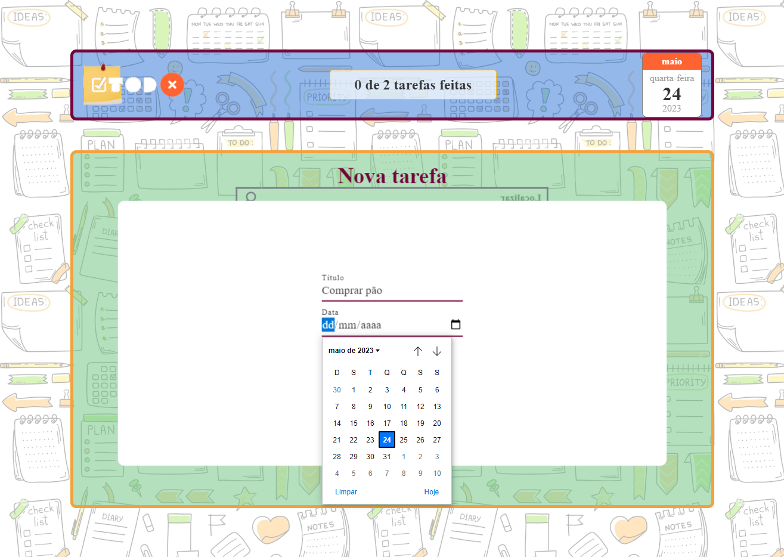
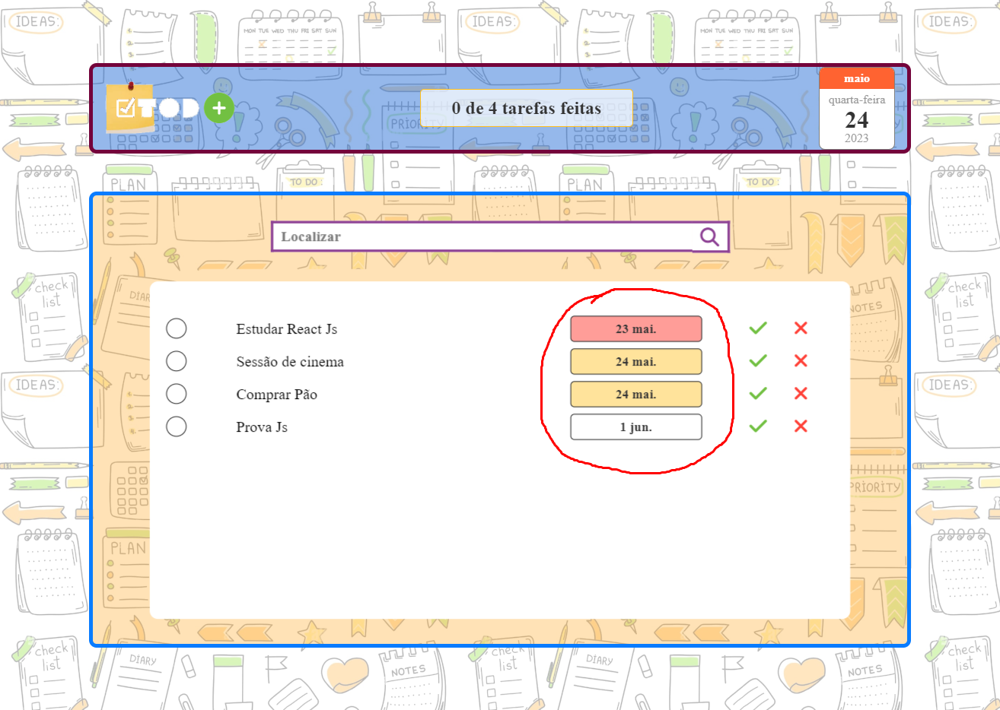
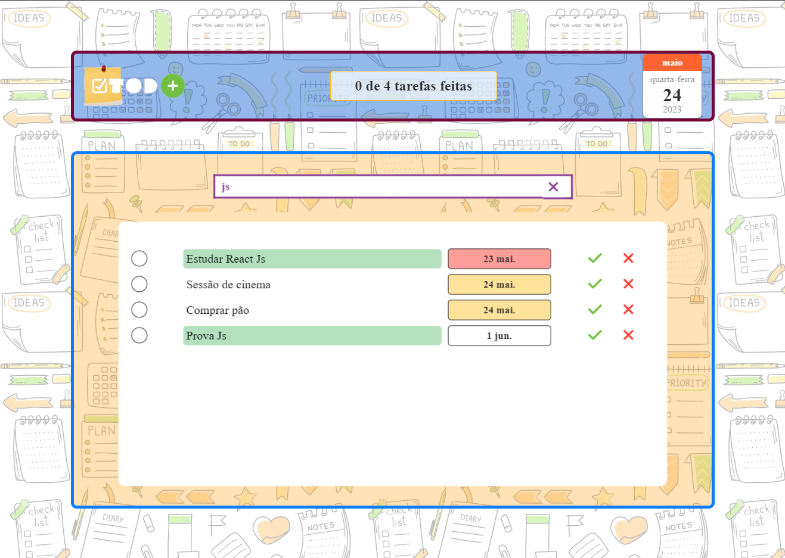
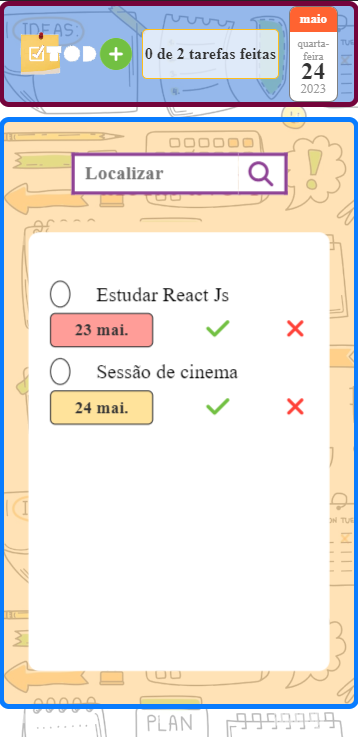

---

# Welcome to TODO! 

Front End Project of a To Do List page with the objective of putting into practice knowledge of Html, Css and JavaScript.

Access the page project here:
https://michel4lves.github.io/Front_ToDo/

---

This is a working To Do system that contains:
- Digital watch;
- Mini calendar;
- Task counter;
- Locator;
- Task list.

However, as it is a Front End project, it does not have a Back End integration with the database. Therefore, if the page is reloaded, all progress will be lost.

## Functionalities:
- Add new task;

- Different colors alerting tasks with due dates or the current day;

- Ordering tasks by date.

- Button for completing tasks;

- Button to delete tasks;

- Task counter and completed tasks;

- Task finder without "case sensitive" that locates in real time as you type.

## Responsive website:

The project responds to the screen size, and can also be accessed on mobile devices.

---

# Bem vindo ao TODO! 
Projeto Front End de uma página To Do List com objetivo de colocar em prática conhecimentos de Html, Css e JavaScript.

Accesse a página do projeto aqui:
https://michel4lves.github.io/Front_ToDo/

---

Essa é um sistema To Do funcional que contém:
- Relógio digital;
- Mini calendário;
- Contador de tarefas;
- Localizador;
- Lista de tarefas.

Porém como trata-se de um projeto de Front End, o mesmo não possui uma integração Back End com banco de dados. Por tanto, caso a página seja recarregada, todo progresso será perdido.

## Funcionalidades:
- Adicionar nova tarefa;

- Cores diferentes alertando tarefas com datas vencidas ou do dia corrente;

- Ordenação das tarefas por data.

- Botão para conclusão das tarefas;

- Botão para exclusão das tarefas;

- Contador de tarefas e tarefas concluídas;

- Localizador de tarefas sem "case sensitive" que vai localizando em tempo real conforme digitação.

## Site responsivo:

O projeto responde ao tamanho de tela, podendo ser acessado também em dispositivos móveis.

